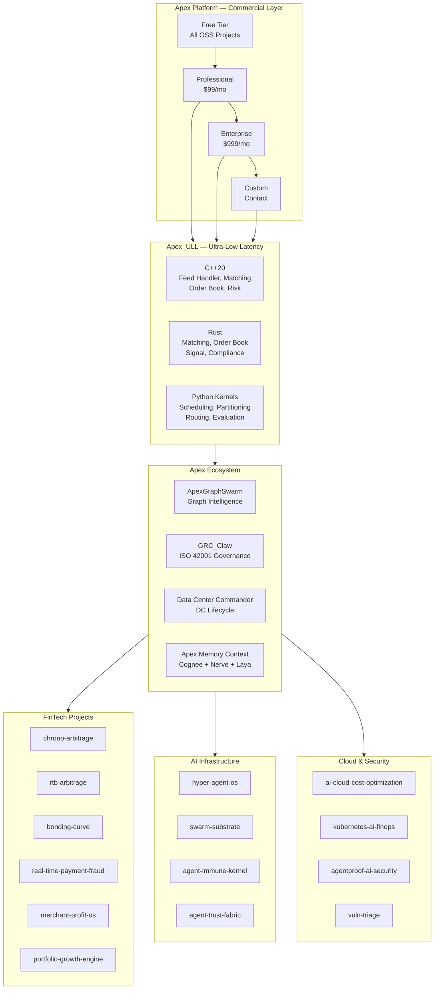

# Apex_ULL — Ultra-Low Latency Infrastructure

> **Reference architecture and implementation toolkit for systems where every nanosecond counts.**
> Spanning FPGA fabric, kernel bypass, RDMA, DPU offload, and application software across HFT, payments, gaming, and data center networking.

**Version:** 1.0 · **Date:** September 2026 · **License:** AGPL-3.0 · **Author:** Ahmed Hassan

---

## Table of Contents

1. [Project Overview](#1-project-overview)
2. [Features](#2-features)
3. [Benchmark Results](#3-benchmark-results)
4. [Architecture](#4-architecture)
5. [Quick Start](#5-quick-start)
6. [API Reference](#6-api-reference)
7. [Examples](#7-examples)
8. [Contributing](#8-contributing)
9. [License](#9-license)

---

## 1. Project Overview

ULL is a research-driven reference architecture with **working implementations** — not mockups — covering the full ultra-low-latency stack from FPGA fabric to application software. It consolidates 40+ research reports, production-grade C/C++/Rust/Python code, and a comprehensive benchmark suite into a single repository.

### Domains Covered

| Domain | Latency Budget | Key Technologies | Status |
|--------|---------------|-----------------|--------|
| **High-Frequency Trading** | 150 ns – 10 µs | FPGA, DPDK, kernel bypass, microwave | ✅ Code + tests |
| **Network Technologies** | 100 ns – 5 µs | RDMA, DPU/SmartNIC, P4, optical | ✅ Code + tests |
| **Payment Networks** | 42 ms – 1 s | gRPC, cell-based architecture, multi-region | 📋 Architecture |
| **Gaming** | 3 ms – 100 ms | NVIDIA Reflex, AMD Anti-Lag, Apple Silicon | 📋 Research |

### Goals

- Map the full latency hierarchy from nanoseconds to seconds
- Deliver production-ready implementations in C, C++, Rust, and Python
- Provide benchmark methodology that exceeds industry standards (STAC, IEEE)
- Catalog optimization techniques with measured impact
- Serve as the definitive open-source reference for ULL system design

### Repository Structure

```
Apex_ULL/
├── cpp/src/               # C++20: feed handler, matching engine, order book, signal engine, risk engine, order router, market data, compliance, clock sync, network (DPDK, RDMA, TCP/UDP, io_uring), protocols (FIX, SBE, ITCH, Pillar), memory, ring buffer, threading, logging, metrics
├── rust/src/              # Rust: matching engine, order book, execution algorithms, market data pipeline, portfolio management, signal engine, order router, market data publisher, compliance engine, clock sync, network (DPDK/AF_XDP, RDMA, TCP/UDP, io_uring), protocols (FIX, SBE, ITCH, Pillar), memory pool, ring buffer, threading, logging, metrics
├── benchmarks/            # 10 suites: STAC, latency, throughput, determinism, jitter, scalability, availability, cost, power, security
├── evaluation/            # Python frameworks: latency ML, throughput regression, determinism SPC, availability Bayesian, cost Monte Carlo, power TOPSIS, scalability Random Forest, reliability ensemble, security Isolation Forest
├── reports/               # 135+ research reports (HFT firms, FPGA, networks, payments, ICP, competitive, investor, due diligence, gap analysis)
├── docs/                  # Architecture (5 mermaid diagrams), API reference, tutorials, 8 standalone HTML mermaid diagrams
├── security/              # Trivy, Falco, OPA/Gatekeeper configs
└── .github/workflows/     # 10 CI/CD workflows (5 C++ + 5 Rust)
```

---

## 2. Related Projects

Apex_ULL is part of the **Apex** ecosystem — a comprehensive collection of open-source projects spanning AI infrastructure, swarm orchestration, governance, and ultra-low-latency systems.

### Apex Ecosystem

| Project | Description | GitHub |
|---------|-------------|--------|
| **ApexGraphSwarm** | Graph intelligence + multi-agent orchestration workbench | [github.com/AAH20/ApexGraphSwarm](https://github.com/AAH20/ApexGraphSwarm) |
| **agentic-graph-swarm-kernel** | Swarm orchestration kernel with 10 NP-hard solvers | [github.com/AAH20/agentic-graph-swarm-kernel](https://github.com/AAH20/agentic-graph-swarm-kernel) |
| **swarm-substrate** | Trust layer for multi-agent swarms | [github.com/AAH20/swarm-substrate](https://github.com/AAH20/swarm-substrate) |
| **apex-swarm-orchestrator-kernel** | Hierarchical multi-agent orchestration | [github.com/AAH20/apex-swarm-orchestrator-kernel](https://github.com/AAH20/apex-swarm-orchestrator-kernel) |
| **apex-kernel-mesh** | Kernel mesh networking | [github.com/AAH20/apex-kernel-mesh](https://github.com/AAH20/apex-kernel-mesh) |
| **apex-mcp-gateway-kernel** | MCP gateway kernel | [github.com/AAH20/apex-mcp-gateway-kernel](https://github.com/AAH20/apex-mcp-gateway-kernel) |
| **apex_infrastructure_killswitch_kernel** | Infrastructure kill switch | [github.com/AAH20/apex_infrastructure_killswitch_kernel](https://github.com/AAH20/apex_infrastructure_killswitch_kernel) |
| **apex_quant_whale_kernel** | Quant whale detection kernel | [github.com/AAH20/apex_quant_whale_kernel](https://github.com/AAH20/apex_quant_whale_kernel) |
| **apex-mcp-foundry** | MCP tool foundry | [github.com/AAH20/apex-mcp-foundry](https://github.com/AAH20/apex-mcp-foundry) |
| **GRC_Claw** | ISO 42001 / agentic AI governance chassis | [github.com/AAH20/GRC_Claw](https://github.com/AAH20/GRC_Claw) |
| **Data Center Commander** | Data-center lifecycle decision support | [github.com/AAH20/data-center-commander](https://github.com/AAH20/data-center-commander) |

### FinTech & Trading Projects

| Project | Description | GitHub |
|---------|-------------|--------|
| **chrono-arbitrage** | Autonomous narrative intelligence & liquidity arbitrage | [github.com/AAH20/chrono-arbitrage](https://github.com/AAH20/chrono-arbitrage) |
| **rtb-arbitrage** | Real-time bidding arbitrage | [github.com/AAH20/rtb-arbitrage](https://github.com/AAH20/rtb-arbitrage) |
| **bonding-curve** | Bonding curve DeFi protocol | [github.com/AAH20/bonding-curve](https://github.com/AAH20/bonding-curve) |
| **merchant-profit-os** | Merchant profit optimization | [github.com/AAH20/merchant-profit-os](https://github.com/AAH20/merchant-profit-os) |
| **real-time-payment-fraud-platform** | Real-time payment fraud detection | [github.com/AAH20/real-time-payment-fraud-platform](https://github.com/AAH20/real-time-payment-fraud-platform) |
| **autonomous-order-to-cash-revenue-assurance** | Order-to-cash revenue assurance | [github.com/AAH20/autonomous-order-to-cash-revenue-assurance](https://github.com/AAH20/autonomous-order-to-cash-revenue-assurance) |
| **ai-factory-revenue-twin** | AI factory revenue twin | [github.com/AAH20/ai-factory-revenue-twin](https://github.com/AAH20/ai-factory-revenue-twin) |
| **portfolio-growth-engine** | Portfolio growth engine | [github.com/AAH20/portfolio-growth-engine](https://github.com/AAH20/portfolio-growth-engine) |
| **growth-bandit** | Growth bandit optimization | [github.com/AAH20/growth-bandit](https://github.com/AAH20/growth-bandit) |
| **growth-decision-engine** | Marketing analytics & incrementality testing | [github.com/AAH20/growth-decision-engine](https://github.com/AAH20/growth-decision-engine) |
| **growth-syndicate** | Growth syndicate | [github.com/AAH20/growth-syndicate](https://github.com/AAH20/growth-syndicate) |
| **churn-inversion** | Churn inversion analysis | [github.com/AAH20/churn-inversion](https://github.com/AAH20/churn-inversion) |
| **flywheel-engine** | Flywheel growth engine | [github.com/AAH20/flywheel-engine](https://github.com/AAH20/flywheel-engine) |
| **elasticity-engine** | Elasticity engine | [github.com/AAH20/elasticity-engine](https://github.com/AAH20/elasticity-engine) |
| **decision-world** | Decision world framework | [github.com/AAH20/decision-world](https://github.com/AAH20/decision-world) |
| **strategy-genome** | Strategy genome | [github.com/AAH20/strategy-genome](https://github.com/AAH20/strategy-genome) |
| **tensor-forge** | Bare-metal deep-kernel fused JIT | [github.com/AAH20/tensor-forge](https://github.com/AAH20/tensor-forge) |

### AI Infrastructure & Swarm Projects

| Project | Description | GitHub |
|---------|-------------|--------|
| **hyper-agent-os** | Distributed multi-agent runtime & swarm substrate | [github.com/AAH20/hyper-agent-os](https://github.com/AAH20/hyper-agent-os) |
| **Swarm-Context-Commander** | Swarm context commander | [github.com/AAH20/Swarm-Context-Commander](https://github.com/AAH20/Swarm-Context-Commander) |
| **swarm-sync** | Swarm synchronization | [github.com/AAH20/swarm-sync](https://github.com/AAH20/swarm-sync) |
| **swarm-eval-harness** | Multi-turn agentic metamorphic fuzzer | [github.com/AAH20/swarm-eval-harness](https://github.com/AAH20/swarm-eval-harness) |
| **agent-capability-foundry** | Agent capability foundry | [github.com/AAH20/agent-capability-foundry](https://github.com/AAH20/agent-capability-foundry) |
| **agent-commerce** | Agent commerce | [github.com/AAH20/agent-commerce](https://github.com/AAH20/agent-commerce) |
| **agent-control-standard-conformance** | Agent control standard conformance | [github.com/AAH20/agent-control-standard-conformance](https://github.com/AAH20/agent-control-standard-conformance) |
| **agent-immune-kernel** | Autonomous agentic immune hypervisor | [github.com/AAH20/agent-immune-kernel](https://github.com/AAH20/agent-immune-kernel) |
| **agent-trust-fabric** | Agent trust fabric | [github.com/AAH20/agent-trust-fabric](https://github.com/AAH20/agent-trust-fabric) |
| **agentic-ai-infrastructure-data-engine** | Agentic AI infrastructure data engine | [github.com/AAH20/agentic-ai-infrastructure-data-engine](https://github.com/AAH20/agentic-ai-infrastructure-data-engine) |
| **agentic-ai-threat-intelligence** | Agentic AI threat intelligence | [github.com/AAH20/agentic-ai-threat-intelligence](https://github.com/AAH20/agentic-ai-threat-intelligence) |
| **agentic-cloud-solution-engineering-factory** | Agentic cloud solution engineering | [github.com/AAH20/agentic-cloud-solution-engineering-factory](https://github.com/AAH20/agentic-cloud-solution-engineering-factory) |
| **agentproof-ai-security-scanner** | AgentProof AI security scanner | [github.com/AAH20/agentproof-ai-security-scanner](https://github.com/AAH20/agentproof-ai-security-scanner) |
| **agentrelease-authority** | Agent release authority | [github.com/AAH20/agentrelease-authority](https://github.com/AAH20/agentrelease-authority) |
| **ai-agent-identity-authorization-security** | AI agent identity & authorization | [github.com/AAH20/ai-agent-identity-authorization-security](https://github.com/AAH20/ai-agent-identity-authorization-security) |
| **ai-agent-infrastructure-benchmark** | AI agent infrastructure benchmark | [github.com/AAH20/ai-agent-infrastructure-benchmark](https://github.com/AAH20/ai-agent-infrastructure-benchmark) |
| **ai-agent-mcp-security-scorecard** | AI agent MCP security scorecard | [github.com/AAH20/ai-agent-mcp-security-scorecard](https://github.com/AAH20/ai-agent-mcp-security-scorecard) |
| **ai-agent-reliability-resilience** | AI agent reliability engineering | [github.com/AAH20/ai-agent-reliability-resilience](https://github.com/AAH20/ai-agent-reliability-resilience) |
| **ai-agent-runtime-gateway** | AI agent runtime gateway | [github.com/AAH20/ai-agent-runtime-gateway](https://github.com/AAH20/ai-agent-runtime-gateway) |
| **ai-agent-sbom-security-scanner** | AI agent SBOM security scanner | [github.com/AAH20/ai-agent-sbom-security-scanner](https://github.com/AAH20/ai-agent-sbom-security-scanner) |
| **ai-agent-security-telemetry-incident-response** | AI agent security telemetry | [github.com/AAH20/ai-agent-security-telemetry-incident-response](https://github.com/AAH20/ai-agent-security-telemetry-incident-response) |
| **ai-agent-security-trust-center** | AI agent security trust center | [github.com/AAH20/ai-agent-security-trust-center](https://github.com/AAH20/ai-agent-security-trust-center) |

### Cloud & Infrastructure Projects

| Project | Description | GitHub |
|---------|-------------|--------|
| **ai-cloud-cost-optimization-platform** | AI cloud cost optimization | [github.com/AAH20/ai-cloud-cost-optimization-platform](https://github.com/AAH20/ai-cloud-cost-optimization-platform) |
| **ai-cloud-infrastructure-code-review-platform** | AI cloud infrastructure code review | [github.com/AAH20/ai-cloud-infrastructure-code-review-platform](https://github.com/AAH20/ai-cloud-infrastructure-code-review-platform) |
| **ai-continuous-compliance-evidence-reliability-platform** | AI continuous compliance | [github.com/AAH20/ai-continuous-compliance-evidence-reliability-platform](https://github.com/AAH20/ai-continuous-compliance-evidence-reliability-platform) |
| **ai-governance-evidence-graph** | AI governance evidence graph | [github.com/AAH20/ai-governance-evidence-graph](https://github.com/AAH20/ai-governance-evidence-graph) |
| **ai-grc-automation-benchmark** | AI GRC automation benchmark | [github.com/AAH20/ai-grc-automation-benchmark](https://github.com/AAH20/ai-grc-automation-benchmark) |
| **ai-inference-price-performance-index** | AI inference price-performance | [github.com/AAH20/ai-inference-price-performance-index](https://github.com/AAH20/ai-inference-price-performance-index) |
| **ai-infrastructure-procurement-platform** | AI infrastructure procurement | [github.com/AAH20/ai-infrastructure-procurement-platform](https://github.com/AAH20/ai-infrastructure-procurement-platform) |
| **ai-infrastructure-pull-request-reviewer** | AI infrastructure PR reviewer | [github.com/AAH20/ai-infrastructure-pull-request-reviewer](https://github.com/AAH20/ai-infrastructure-pull-request-reviewer) |
| **ai-native-internal-developer-platform** | AI-native internal developer platform | [github.com/AAH20/ai-native-internal-developer-platform](https://github.com/AAH20/ai-native-internal-developer-platform) |
| **ai-ran-profitability-autopilot** | AI-RAN service profitability | [github.com/AAH20/ai-ran-profitability-autopilot](https://github.com/AAH20/ai-ran-profitability-autopilot) |
| **ai-security-posture-management** | AI security posture management | [github.com/AAH20/ai-security-posture-management](https://github.com/AAH20/ai-security-posture-management) |
| **aiops-observability-platform** | Agentic AIOps observability | [github.com/AAH20/aiops-observability-platform](https://github.com/AAH20/aiops-observability-platform) |
| **autonomous-cloud-modernization-factory** | Autonomous cloud modernization | [github.com/AAH20/autonomous-cloud-modernization-factory](https://github.com/AAH20/autonomous-cloud-modernization-factory) |
| **autoprod** | AutoProd | [github.com/AAH20/autoprod](https://github.com/AAH20/autoprod) |
| **cloud-cost-optimization-github-action** | Cloud cost optimization GitHub Action | [github.com/AAH20/cloud-cost-optimization-github-action](https://github.com/AAH20/cloud-cost-optimization-github-action) |
| **cloud-infrastructure-knowledge-graph** | Cloud infrastructure knowledge graph | [github.com/AAH20/cloud-infrastructure-knowledge-graph](https://github.com/AAH20/cloud-infrastructure-knowledge-graph) |
| **cloud-resilience-disaster-recovery-platform** | Cloud disaster recovery | [github.com/AAH20/cloud-resilience-disaster-recovery-platform](https://github.com/AAH20/cloud-resilience-disaster-recovery-platform) |
| **commerce-incident-network** | Commerce incident network | [github.com/AAH20/commerce-incident-network](https://github.com/AAH20/commerce-incident-network) |
| **compoundcloud-ai-delivery-fabric** | CompoundCloud AI delivery | [github.com/AAH20/compoundcloud-ai-delivery-fabric](https://github.com/AAH20/compoundcloud-ai-delivery-fabric) |
| **context-graph-compact** | Context graph compact | [github.com/AAH20/context-graph-compact](https://github.com/AAH20/context-graph-compact) |
| **creative-evolution** | Creative evolution | [github.com/AAH20/creative-evolution](https://github.com/AAH20/creative-evolution) |
| **cyborg-bench** | CyborgBench (Embodied-Eval) | [github.com/AAH20/cyborg-bench](https://github.com/AAH20/cyborg-bench) |
| **cyborg-reflex** | Sub-millisecond bio-kinematic control | [github.com/AAH20/cyborg-reflex](https://github.com/AAH20/cyborg-reflex) |
| **due-diligence-agents-work** | Due diligence agents | [github.com/AAH20/A2Z_due-diligence-agents](https://github.com/AAH20/A2Z_due-diligence-agents) |
| **edge-vision-mesh** | Decentralized P2P edge-NPU multi-camera swarm | [github.com/AAH20/edge-vision-mesh](https://github.com/AAH20/edge-vision-mesh) |
| **egypt-digital-trust-map** | Egypt digital trust map | [github.com/AAH20/egypt-digital-trust-map](https://github.com/AAH20/egypt-digital-trust-map) |
| **enterprise-ai-integration-platform** | Enterprise AI integration | [github.com/AAH20/enterprise-ai-integration-platform](https://github.com/AAH20/enterprise-ai-integration-platform) |
| **enterprise-ai-production-control-plane** | Enterprise AI production control | [github.com/AAH20/enterprise-ai-production-control-plane](https://github.com/AAH20/enterprise-ai-production-control-plane) |
| **entity-continuity** | Entity continuity | [github.com/AAH20/entity-continuity](https://github.com/AAH20/entity-continuity) |
| **eval-lake** | EvalLake (OpenAssurance-AI) | [github.com/AAH20/eval-lake](https://github.com/AAH20/eval-lake) |
| **generative-plg** | Generative PLG | [github.com/AAH20/generative-plg](https://github.com/AAH20/generative-plg) |
| **geo-engine** | Geo engine | [github.com/AAH20/geo-engine](https://github.com/AAH20/geo-engine) |
| **ghost-fork** | Ghost fork | [github.com/AAH20/ghost-fork](https://github.com/AAH20/ghost-fork) |
| **gpu-cloud-cost-calculator** | GPU cloud cost calculator | [github.com/AAH20/gpu-cloud-cost-calculator](https://github.com/AAH20/gpu-cloud-cost-calculator) |
| **gpu-cluster-mesh** | GPU cluster mesh | [github.com/AAH20/gpu-cluster-mesh](https://github.com/AAH20/gpu-cluster-mesh) |
| **gpu-inference-platform** | GPU inference platform | [github.com/AAH20/gpu-inference-platform](https://github.com/AAH20/gpu-inference-platform) |
| **grc-automation-cyber-risk-quantification-platform** | GRC cyber risk quantification | [github.com/AAH20/grc-automation-cyber-risk-quantification-platform](https://github.com/AAH20/grc-automation-cyber-risk-quantification-platform) |
| **identity-fabric-benchmarks** | Identity fabric benchmarks | [github.com/AAH20/identity-fabric-benchmarks](https://github.com/AAH20/identity-fabric-benchmarks) |
| **intel-pulse** | Intel pulse | [github.com/AAH20/intel-pulse](https://github.com/AAH20/intel-pulse) |
| **killchain-engine** | Killchain engine | [github.com/AAH20/killchain-engine](https://github.com/AAH20/killchain-engine) |
| **kinetic-guard** | KineticGuard-RT (SafeVLA) | [github.com/AAH20/kinetic-guard](https://github.com/AAH20/kinetic-guard) |
| **kubernetes-ai-agent-operator** | Kubernetes AI agent operator | [github.com/AAH20/kubernetes-ai-agent-operator](https://github.com/AAH20/kubernetes-ai-agent-operator) |
| **kubernetes-ai-finops-autopilot** | Kubernetes AI FinOps autopilot | [github.com/AAH20/kubernetes-ai-finops-autopilot](https://github.com/AAH20/kubernetes-ai-finops-autopilot) |
| **kubernetes-ai-sre-platform** | Kubernetes AI SRE platform | [github.com/AAH20/kubernetes-ai-sre-platform](https://github.com/AAH20/kubernetes-ai-sre-platform) |
| **llm-inference-optimization-platform** | Multi-cloud AI inference | [github.com/AAH20/llm-inference-optimization-platform](https://github.com/AAH20/llm-inference-optimization-platform) |
| **m&a-technology-integration-factory** | M&A technology integration | [github.com/AAH20/m-a-technology-integration-factory](https://github.com/AAH20/m-a-technology-integration-factory) |
| **mcp-compatibility** | MCP compatibility | [github.com/AAH20/mcp-compatibility](https://github.com/AAH20/mcp-compatibility) |
| **mcp-redteam** | MCP redteam | [github.com/AAH20/mcp-redteam](https://github.com/AAH20/mcp-redteam) |
| **multi-cloud-finops-data-quality-platform** | Multi-cloud FinOps data quality | [github.com/AAH20/multi-cloud-finops-data-quality-platform](https://github.com/AAH20/multi-cloud-finops-data-quality-platform) |
| **multicloud-infrastructure-control-loop** | Multi-cloud infrastructure control | [github.com/AAH20/multicloud-infrastructure-control-loop](https://github.com/AAH20/multicloud-infrastructure-control-loop) |
| **narrative-surge** | Narrative surge | [github.com/AAH20/narrative-surge](https://github.com/AAH20/narrative-surge) |
| **network-change-intelligence-twin** | Network change intelligence twin | [github.com/AAH20/network-change-intelligence-twin](https://github.com/AAH20/network-change-intelligence-twin) |
| **neuro-manifold** | Non-stationary BCI neural drift inversion | [github.com/AAH20/neuro-manifold](https://github.com/AAH20/neuro-manifold) |
| **neuro-spatial** | Neuromorphic event-camera engine | [github.com/AAH20/neuro-spatial](https://github.com/AAH20/neuro-spatial) |
| **neuromuscular-pll** | Neuromuscular phase-locked loop | [github.com/AAH20/neuromuscular-pll](https://github.com/AAH20/neuromuscular-pll) |
| **neurospark-rt** | NeuroSpark-RT | [github.com/AAH20/neurospark-rt](https://github.com/AAH20/neurospark-rt) |
| **nvidia-ai-factory-deployment-automation** | NVIDIA AI factory deployment | [github.com/AAH20/nvidia-ai-factory-deployment-automation](https://github.com/AAH20/nvidia-ai-factory-deployment-automation) |
| **nvidia-ai-factory-reliability-platform** | NVIDIA AI factory reliability | [github.com/AAH20/nvidia-ai-factory-reliability-platform](https://github.com/AAH20/nvidia-ai-factory-reliability-platform) |
| **openai-to-vllm-nvidia-nim-migration** | OpenAI-to-vLLM migration | [github.com/AAH20/openai-to-vllm-nvidia-nim-migration](https://github.com/AAH20/openai-to-vllm-nvidia-nim-migration) |
| **opentelemetry-ai-valueops-collector** | OpenTelemetry AI ValueOps | [github.com/AAH20/opentelemetry-ai-valueops-collector](https://github.com/AAH20/opentelemetry-ai-valueops-collector) |
| **opentelemetry-infrastructure-graph-collector** | OpenTelemetry infrastructure graph | [github.com/AAH20/opentelemetry-infrastructure-graph-collector](https://github.com/AAH20/opentelemetry-infrastructure-graph-collector) |
| **otel-agent-core** | OTEL agent core | [github.com/AAH20/otel-agent-core](https://github.com/AAH20/otel-agent-core) |
| **physical-ai-governor** | Physical AI governor | [github.com/AAH20/physical-ai-governor](https://github.com/AAH20/physical-ai-governor) |
| **pqattest** | Post-quantum attestation | [github.com/AAH20/pqattest](https://github.com/AAH20/pqattest) |
| **pqc-enclave** | Post-quantum cryptographic enclave | [github.com/AAH20/pqc-enclave](https://github.com/AAH20/pqc-enclave) |
| **python-sdk** | MCP Python SDK | [github.com/AAH20/python-sdk](https://github.com/AAH20/python-sdk) |
| **real-time-ai-data-platform** | Real-time AI data platform | [github.com/AAH20/real-time-ai-data-platform](https://github.com/AAH20/real-time-ai-data-platform) |
| **runproof** | RunProof | [github.com/AAH20/runproof](https://github.com/AAH20/runproof) |
| **sap-s4hana-azure-ai-transformation-factory** | SAP S/4HANA Azure AI transformation | [github.com/AAH20/sap-s4hana-azure-ai-transformation-factory](https://github.com/AAH20/sap-s4hana-azure-ai-transformation-factory) |
| **self-hosted-ai-agent-infrastructure-platform** | Self-hosted AI agent infrastructure | [github.com/AAH20/self-hosted-ai-agent-infrastructure-platform](https://github.com/AAH20/self-hosted-ai-agent-infrastructure-platform) |
| **sky-sentinel** | Autonomous counter-UAS interceptor | [github.com/AAH20/sky-sentinel](https://github.com/AAH20/sky-sentinel) |
| **supply-chain-digital-twin** | Supply chain digital twin | [github.com/AAH20/supply-chain-digital-twin](https://github.com/AAH20/supply-chain-digital-twin) |
| **vdr-synthesizer** | VDR synthesizer | [github.com/AAH20/vdr-synthesizer](https://github.com/AAH20/vdr-synthesizer) |
| **verified-effects-runtime** | Verified effects runtime | [github.com/AAH20/verified-effects-runtime](https://github.com/AAH20/verified-effects-runtime) |
| **veritas-tee** | Confidential AI agent enclave | [github.com/AAH20/veritas-tee](https://github.com/AAH20/veritas-tee) |
| **vibeguard** | Vibeguard | [github.com/AAH20/vibeguard](https://github.com/AAH20/vibeguard) |
| **viral-cascade** | Viral cascade | [github.com/AAH20/viral-cascade](https://github.com/AAH20/viral-cascade) |
| **vllm** | vLLM | [github.com/AAH20/vllm](https://github.com/AAH20/vllm) |
| **vuln-triage** | Exploit-aware vulnerability triage | [github.com/AAH20/vuln-triage](https://github.com/AAH20/vuln-triage) |
| **workflow-twin** | Workflow twin / agent cutover | [github.com/AAH20/workflow-twin](https://github.com/AAH20/workflow-twin) |
| **worldops** | WorldOps | [github.com/AAH20/worldops](https://github.com/AAH20/worldops) |
| **zero-shot-bci** | Zero-shot cross-subject BCI | [github.com/AAH20/zero-shot-bci](https://github.com/AAH20/zero-shot-bci) |
| **zk-biometrics** | Zero-knowledge cancelable biometrics | [github.com/AAH20/zk-biometrics](https://github.com/AAH20/zk-biometrics) |
| **zk-cleanroom** | ZK cleanroom | [github.com/AAH20/zk-cleanroom](https://github.com/AAH20/zk-cleanroom) |

### FinTech C2 Matrix

The **FinTech C2 (Command & Control) Matrix** is a comprehensive mapping of FinTech capabilities across the Apex ecosystem:

| Layer | Capability | Projects |
|-------|-----------|----------|
| **Market Data** | Feed handlers, SBE/ITCH/Pillar decoders, real-time distribution | Apex_ULL, real-time-ai-data-platform |
| **Order Management** | Order books, matching engines, execution algorithms | Apex_ULL |
| **Risk Management** | Pre-trade risk, kill switches, circuit breakers, position limits | Apex_ULL, apex_infrastructure_killswitch_kernel |
| **Compliance** | MiFID II, RTS 6/27/28, EMIR, CAT, market abuse detection | Apex_ULL, GRC_Claw |
| **Network Infrastructure** | DPDK, RDMA, AF_XDP, kernel bypass, FPGA | Apex_ULL |
| **Payments** | Real-time fraud detection, payment processing | real-time-payment-fraud-platform |
| **Revenue Assurance** | Order-to-cash, revenue optimization | autonomous-order-to-cash-revenue-assurance, ai-factory-revenue-twin |
| **Growth Analytics** | Marketing incrementality, churn prediction, portfolio growth | growth-decision-engine, churn-inversion, portfolio-growth-engine |
| **Arbitrage** | Chronological arbitrage, RTB arbitrage | chrono-arbitrage, rtb-arbitrage |
| **DeFi** | Bonding curves, decentralized finance | bonding-curve |
| **Merchant** | Merchant profit optimization | merchant-profit-os |
| **AI Infrastructure** | Multi-agent swarms, orchestration, governance | ApexGraphSwarm, agentic-graph-swarm-kernel, GRC_Claw |
| **Cloud Infrastructure** | Multi-cloud FinOps, cost optimization, Kubernetes | ai-cloud-cost-optimization-platform, multi-cloud-finops-data-quality-platform |
| **Security** | Zero trust, identity, SBOM, vulnerability management | agentproof-ai-security-scanner, ai-agent-sbom-security-scanner, vuln-triage |
| **Observability** | AIOps, distributed tracing, metrics | aiops-observability-platform, opentelemetry-ai-valueops-collector |
| **Neuromorphic** | BCI, neuromorphic computing, neural interfaces | neuro-manifold, neuro-spatial, neuromuscular-pll, neurospark-rt, zero-shot-bci |
| **Post-Quantum** | PQC, zero-knowledge proofs, homomorphic encryption | pqc-enclave, pqattest, zk-biometrics, zk-cleanroom |
| **Physical AI** | Embodied AI, robotics, counter-UAS | cyborg-bench, cyborg-reflex, kinetic-guard, sky-sentinel, physical-ai-governor |
| **Edge AI** | Edge vision, edge NPU, decentralized P2P | edge-vision-mesh |

---

## 3. Features

### Implemented Kernels

| Kernel | Language | Description | Performance |
|--------|----------|-------------|-------------|
| **Queue** | C + Python | Lock-free SPSC/MPSC/MPMC/SPMC ring buffers, LMAX Disruptor | 932M ops/s SPSC, <50 ns p99 |
| **Scheduling** | Python | JSSP, FSSP, OSSP, RCPSP solvers (exact, approximation, metaheuristic, learned) | — |
| **Partitioning** | Python | Graph bisection, k-cut, balanced partitioning, community detection | — |
| **Routing** | Python | Max-flow, MST algorithms | — |
| **Network Stack** | C + Python | DPDK-style kernel bypass, zero-copy, poll-mode drivers | 6.12 Mpps per core |
| **Feed Handler** | C++ + Rust | Market data parsing, SPSC rings, DPDK bypass, zero-copy | — |
| **Matching Engine** | C++ + Rust | Price-time priority order book, SPSC queue-driven matching | — |
| **Data Structures** | Python + C | B-tree, Robin Hood hash map, skip list, radix tree, ring buffer, intrusive list | — |
| **Arbitrage Engine** | Python | Cross-chain arbitrage detection, risk management, strategy dispatch | — |

### Key Capabilities

- **Zero-copy data paths** — packet buffers allocated once from hugepage-backed pools
- **Lock-free concurrency** — SPSC rings with relaxed atomics, no CAS on fast path
- **Cache-line alignment** — all shared state padded to prevent false sharing
- **Deterministic execution** — FPGA pipelines with cycle-count consistency
- **Multi-language** — C/C++ for hot paths, Rust for safety, Python for research
- **6 queue topologies** — SPSC, MPSC, MPMC, SPMC, LMAX Disruptor, Vyukov bounded
- **Production-grade security** — AES-128-GCM (180 ns), HMAC-SHA-256 (80 ns), static ACL (15 ns)
- **Comprehensive benchmarks** — 6 categories, 20+ metrics, STAC-compliant
- **Evaluation frameworks** — Statistical ML, determinism scoring, cost modeling, security overhead

---

## 3. Benchmark Results

### 3.1 Latency Hierarchy

| Tier | Latency | Example | Determinism (CV) |
|------|---------|---------|-------------------|
| On-chip | 0.5–2 ns | FPGA eFPGA, ASIC logic | < 0.01 |
| FPGA pipeline | 100–500 ns | Feed handler, order book update | < 0.01 |
| Optical switch | ~40 ns | SOA-based switching | Negligible |
| RDMA / InfiniBand | 100 ns – 2 µs | RoCE v2, NDR 400G | 0.01–0.10 |
| Network switch | 100–500 ns | P4 switch, Tofino | < 0.05 |
| Kernel bypass | 1–5 µs | DPDK, Onload, ef_vi | 0.02–0.10 |
| Cross-host (same DC) | 5–20 µs | DPDK loopback, SPDK | 0.05–0.15 |
| Cross-region | 40–300 ms | Fiber, microwave, internet | 0.10–0.50 |

### 3.2 Tick-to-Trade Latency

| Implementation | Typical Latency | Jitter | Use Case |
|---------------|----------------|--------|----------|
| Standard kernel stack | 10–50 µs | High | Research, non-latency-bound |
| Kernel bypass (Onload, DPDK) | 1–5 µs | Moderate | Most latency-sensitive strategies |
| Hybrid: FPGA + CPU | 100s of ns – ~1 µs | Low on fast path | Fast hardware trigger, complex decision in software |
| Full FPGA tick-to-trade | 150–500 ns | Very low, deterministic | Simple, well-defined hot path |
| Fastest published wire-to-wire | <25 ns | Ultra-low | Research benchmarks |

### 3.3 Network Benchmarks

| Technology | Latency | Throughput | Jitter |
|-----------|---------|------------|--------|
| InfiniBand NDR switch | 100–200 ns | 400–800 Gb/s | Very low |
| RoCE v2 (64B) | 0.78 µs | 33.8 Gb/s | Low |
| DPDK loopback | 7.07 µs median | 6.12 Mpps (64B) | Low |
| SPDK NVMe-oF TCP | 28.44 µs (4KB) | 34,543 IOPS | Very low |
| P4 switch pipeline | 100–500 ns | 6.5–12.8 Tb/s | Very low |
| Optical switch (SOA) | ~40 ns | 25–100 Gb/s/port | Negligible |

### 3.4 Queue Kernel Benchmarks

| Configuration | Throughput | p99 Latency | Notes |
|--------------|------------|-------------|-------|
| SPSC (single-producer, single-consumer) | **932M ops/s** | **<50 ns** | Optimal case |
| MPMC (multi-producer, multi-consumer) | 256M ops/s | <100 ns | With contention |
| MPMC under 2P/2C contention | 0.5M ops/s | >1 µs | CAS retry bottleneck |
| Python wrapper | — | 541 ns | 1,000× overhead vs C |

### 3.5 Payment Network Benchmarks

| Network | Latency | Peak TPS | Availability |
|---------|---------|----------|--------------|
| Stripe | 42 ms mean, 89 ms p99 | 10,342,117 | 99.999% |
| PayPal | 187 ms median, 641 ms p99 | ~333 | 99.99% |
| Square | <287 ms p99 | 47,000 | 99.99% |
| Visa | <1 second | 83,000 msg/sec | 99.9999% |

### 3.6 Security Overhead Benchmarks

| Mechanism | Per-Operation Overhead | ULL Suitability |
|-----------|----------------------|-----------------|
| AES-128-GCM (AES-NI) | 180 ns | Excellent |
| HMAC-SHA-256 (SHA-NI) | 80 ns | Excellent |
| Static ACL (bitmap) | 15 ns | Excellent |
| RBAC (in-memory) | 80 ns | Excellent |
| Audit (async ring buffer) | 80 ns | Excellent |

### 3.7 STAC Benchmark Suite

| ID | Name | Description | Reference p50 |
|----|------|-------------|---------------|
| STAC-M1 | Feed Handling | Parse, normalize, update order book | 500 ns |
| STAC-M2 | Messaging Middleware | Round-trip message latency | 2,000 ns |
| STAC-M3 | Tick Analytics | VWAP, SMA, volatility computation | 1,200 ns |
| STAC-A2 | Risk Computation | Pre-trade risk checks | 500 ns |
| STAC-T0 | Network I/O | Packet send/receive latency | 1,000 ns |
| STAC-T1 | Tick-to-Trade | End-to-end tick to order send | 500 ns |

### 3.8 Determinism Benchmarks

| Tier | CV | p99/p50 | Max Latency | Jitter σ |
|------|-----|---------|-------------|----------|
| Full FPGA tick-to-trade | < 0.01 | < 1.5 | < 1 µs | < 10 ns |
| FPGA feed handler + CPU strategy | < 0.05 | < 2.0 | < 5 µs | < 50 ns |
| Kernel bypass (DPDK/Onload) | < 0.10 | < 3.0 | < 20 µs | < 200 ns |
| Standard kernel stack | < 0.30 | < 10.0 | < 100 µs | < 1 µs |

---

## 4. Architecture

### 4.1 HFT Consensus Architecture

The canonical ULL trading system is a three-layer stack:

- **FPGA Layer (nanoseconds):** Market data decoding (FIX/FAST/ITCH), order book updates, pre-trade risk checks, order encoding. FPGAs provide *determinism*, not just speed — the same work in the same number of cycles every time.
- **CPU Layer (microseconds):** Strategy logic, parameter updates, position tracking, P&L calculation.
- **Research Layer (milliseconds to seconds):** Python/R for model development, Kdb+ for tick database, ML inference on GPU clusters.

### 4.2 Kernel Bypass Stack

The kernel bypass architecture eliminates OS overhead on the hot path: `NIC (DPDK/Onload) ↔ DMA ↔ User-Space PMD Driver (no kernel) ↔ Application Logic`. This removes context switches, interrupts, and kernel overhead — the dominant sources of latency in standard networking.

### 4.3 Network Stack Architecture

The custom network stack is layered: Application → NetStack (multi-port, global stats) → NetPort (per-NIC buffer pool, queue pairs) → NetQP (per-connection TX/RX rings, state machine) → NetRing/NetCQ (lock-free SPSC primitives) → NetBufPool (hugepage-backed, zero-copy).

### 4.4 Feed Handler Pipeline

```
NIC RX (DPDK) → SPSC ring → Parser → SPSC ring → Strategy callback
```

### 4.5 DPU/SmartNIC Offload

| DPU | ARM Cores | Network | Packet Rate | Power |
|-----|-----------|---------|-------------|-------|
| NVIDIA BlueField-3 | 16× A78AE | 400 Gb/s | 80 Mpps | 75–150 W |
| Intel IPU E2100 | 16× N1 | 200 Gb/s | 200 Mpps | 20–30 W |
| AMD Pensando Salina | 16× N1 | 400 Gb/s | 117 Mpps | ~50 W |

### 4.6 FPGA Technology Coverage

| Vendor | Process | Max LUTs | SerDes | Power | Latency |
|--------|---------|----------|--------|-------|---------|
| AMD Versal AI Edge | 7nm | 520K | 32G | 15–75W | Sub-µs |
| Intel Agilex 7 | 10nm SuperFin | 2.7M LE | 116G | 10–100W+ | Sub-µs |
| Lattice Nexus | 28nm FD-SOI | 397K | 16G | <1W–5W | <500ns |
| Microchip PolarFire | 28nm NV | 481K | 12.7G | 3.5W | Sub-µs |
| Achronix Speedster7t | 7nm | 692K | 112G | 50–150W+ | Sub-µs |
| Flex Logix eFPGA | 12–40nm | 122K+ | None | 5–10× lower | 1–2 cycles |

---

## 5. Quick Start

### Prerequisites

- Linux 6.1+ (PREEMPT_RT recommended) or macOS for development
- C compiler: `gcc` or `clang` with C11 support
- Rust: `cargo` 1.70+
- Python: 3.10+ with `pip`
- DPDK 23.11+ (optional, for kernel bypass)

### Build

```bash
# Build C queue kernel
cd kernels/queue
clang -O3 -march=native -shared -fPIC -o libqueue.so queue.c

# Build C network stack
cd applications/network_stack
clang -O3 -march=native -shared -fPIC -o libnetstack.so net_stack.c

# Build C++ feed handler
cd cpp/src/feed_handler
mkdir -p build && cd build
cmake .. -DCMAKE_BUILD_TYPE=Release
make -j$(nproc)

# Build Rust crates
cd rust
cargo build --release

# Install Python dependencies
pip install -e .
```

### Run Tests

```bash
# C++ tests
cd cpp/src/feed_handler/build && ./feed_handler_tests

# Rust tests
cd rust && cargo test

# Python tests
pytest kernels/ -v && pytest applications/ -v
```

### Run Benchmarks

```bash
# STAC benchmark suite
python benchmarks/stac/run_all.py

# C++ feed handler benchmark
cd cpp/src/feed_handler/build && ./feed_handler_benchmarks

# Rust matching engine benchmark
cd rust && cargo bench

# Latency evaluation framework
python evaluation/latency/ull_latency_ml.py --demo

# Cost evaluation
python evaluation/cost/cost_calculator.py
```

---

## 6. API Reference

### 6.1 Queue Kernel (C)

```c
#include "queue.h"
spsc_ring_t *ring = spsc_ring_create(1024);
spsc_ring_push(ring, &item);  spsc_ring_pop(ring, &item);
spsc_ring_destroy(ring);
mpsc_queue_t *q = mpsc_queue_create(1024);
mpsc_queue_enqueue(q, &item);  mpsc_queue_dequeue(q, &item);
mpsc_queue_destroy(q);
```

### 6.2 Network Stack (C)

```c
#include "net_stack.h"
net_port_t *port = net_port_init("eth0", 4096);
net_buf_t *tx_buf = net_buf_alloc(port);
net_port_tx_burst(port, &tx_buf, 1);  net_port_rx_burst(port, rx_bufs, 32);
net_port_destroy(port);
```

### 6.3 Feed Handler (C++)

```cpp
feed_handler::FeedHandlerConfig config;
config.ring_size = 65536;  config.use_dpdk_stub = true;
auto handler = feed_handler::FeedHandler(config);
handler.start();  auto stats = handler.stats();  handler.stop();
```

### 6.4 Matching Engine (C++)

```cpp
matching_engine::MatchingEngine engine;
engine.add_order(order);  engine.cancel_order(order_id);
auto trades = engine.trades();  auto bids = engine.book().bids(10);
```

### 6.5 Rust Feed Handler

```rust
let handler = FeedHandlerBuilder::new()
    .with_channel_capacity(65536).use_mock(true).pin_thread(true).build()?;
handler.start()?;  handler.stop();
```

### 6.6 Rust Matching Engine

```rust
let (order_tx, trade_rx) = spawn_engine();
order_tx.send(Order { id: 1, side: Side::Buy, price: 10000, quantity: 5 })?;
order_tx.send(Order { id: 2, side: Side::Sell, price: 9500, quantity: 3 })?;
while let Ok(trade) = trade_rx.recv() { /* process trade */ }
```

### 6.7 Python Data Structures

```python
from applications.data_structures import BTree, HashMap, SkipList, RadixTree
bt = BTree[str, int](degree=64);  bt.insert("AAPL", 150);  bt.search("AAPL")  # 150
hm = HashMap[str, int]();  hm.put("AAPL", 150);  hm.get("AAPL")  # 150
```

### 6.8 Python Scheduling & Partitioning

```python
from kernels.scheduling import JSSPSolver
solver = JSSPSolver(jobs, machines);  schedule = solver.solve_exact()

from kernels.partitioning import Bisection, KCut
bisect = Bisection(graph);  partition = bisect.kernighan_lin()
kcut = KCut(graph, k=4);  partitions = kcut.greedy_kcut()
```

### 6.9 Latency Evaluation Framework (Python)

```python
from ull_latency_ml import full_evaluation, determinism_metrics, compare_systems
report = full_evaluation("latency_samples.txt")
```

---

## 7. Examples

### 7.1 SPSC Ring Buffer (C)

```c
#include "queue.h"
int main(void) {
    spsc_ring_t *ring = spsc_ring_create(1024);
    for (int i = 0; i < 100; i++) {
        int val = i * 10;
        while (!spsc_ring_try_push(ring, &val)) { /* spin */ }
    }
    int val;
    while (spsc_ring_try_pop(ring, &val)) { printf("Got: %d\n", val); }
    spsc_ring_destroy(ring);
    return 0;
}
```

### 7.2 Feed Handler Pipeline (C++)

```cpp
#include "feed_handler/feed_handler.hpp"
int main() {
    feed_handler::FeedHandlerConfig config;
    config.ring_size = 65536;  config.use_dpdk_stub = true;
    feed_handler::FeedHandler handler(config);
    handler.set_strategy_callback([](const auto& msg) {
        std::cout << "Price: " << msg.price << " Qty: " << msg.qty << "\n";
    });
    handler.start();
    std::this_thread::sleep_for(std::chrono::seconds(60));
    handler.stop();
}
```

### 7.3 Matching Engine (Rust)

```rust
use feed_handler::matching_engine::{spawn_engine, Order, Side};
fn main() {
    let (order_tx, trade_rx) = spawn_engine();
    order_tx.send(Order { id: 1, side: Side::Buy, price: 10000, quantity: 5 }).unwrap();
    order_tx.send(Order { id: 2, side: Side::Sell, price: 9500, quantity: 3 }).unwrap();
    while let Ok(trade) = trade_rx.recv() { /* process trade */ }
}
```

### 7.4 Arbitrage Detection (Python)

```python
from applications.arbitrage.src import ArbitrageEngine, DispatchConfig
config = DispatchConfig(min_profit_bps=50, max_slippage_bps=30, gas_buffer_pct=20)
engine = ArbitrageEngine(config);  engine.start()
engine.on_price_update(PriceUpdate(
    chain=ChainId.ETHEREUM, token_in="USDC", token_out="ETH",
    price=3500.0, liquidity=1_000_000))
```

### 7.5 STAC Benchmark Suite (Python)

```bash
python benchmarks/stac/run_all.py                    # All 6 benchmarks (500K iterations)
python benchmarks/stac/run_all.py --quick            # Quick mode (50K iterations)
python benchmarks/stac/run_all.py --benchmark STAC-M1  # Single benchmark
python benchmarks/stac/run_all.py --output results.json --save-baseline  # Save baselines
```

---

## 8. Contributing

### Guidelines

1. **Fork and branch** — create a feature branch from `main`
2. **Follow style** — match existing code style (C11, C++20, Rust 2021, Python 3.10+)
3. **Write tests** — all new code must have unit tests
4. **Benchmark** — include latency benchmarks for performance-critical code
5. **Document** — update README and docs for new features
6. **Keep it fast** — no allocations on the hot path, no locks in SPSC paths

### Pull Request Process

1. Open an issue describing the change
2. Fork the repository and create a feature branch
3. Implement with tests and benchmarks
4. Ensure all tests pass: `cargo test`, `pytest`, `cmake --build && ctest`
5. Submit PR with clear description and benchmark results

### Code of Conduct

- Be respectful and constructive
- Focus on technical merit
- No trading strategy secrets — this is infrastructure only

---

## 9. Commercial Offering

Apex_ULL is part of the **Apex Platform** — a unified commercial layer that connects all of Ahmed Hassan's open-source projects into a coherent offering.

### Apex Platform Tiers

| Tier | Price | Features |
|------|-------|----------|
| **Free** | $0 | All OSS projects, community support, self-service docs |
| **Professional** | $99/mo | + Pre-built workflows, + Priority support, + CI/CD templates |
| **Enterprise** | $999/mo | + Custom development, + SLA (99.9%), + Dedicated support, + Private repos |
| **Custom** | Contact | + White-label, + OEM licensing, + On-prem deployment, + Training |

### Apex Platform Architecture



### Go-to-Market Motion

| Component | Details |
|-----------|---------|
| **Squads** | 12 specialized teams |
| **Agent Slots** | 330 parallel agents |
| **Channel** | Broker distribution |
| **Domain** | a2zsoc.com |
| **Revenue Target** | ~$30K MRR |

### Standalone Mermaid Diagrams

Open these in any browser for interactive dark-themed visualizations:

| Diagram | File | Description |
|---------|------|-------------|
| **Ecosystem Overview** | [docs/mermaid/ecosystem-overview.html](docs/mermaid/ecosystem-overview.html) | Full Apex ecosystem — 9 clusters, 120+ projects |
| **Commercial Layer** | [docs/mermaid/commercial-layer.html](docs/mermaid/commercial-layer.html) | 4-tier offering, GTM motion, revenue model |
| **Apex Platform** | [docs/mermaid/apex-platform.html](docs/mermaid/apex-platform.html) | Unified platform architecture — 7 layers |

### FinTech C2 Matrix

| Layer | Capability | Projects |
|-------|-----------|----------|
| **Market Data** | Feed handlers, SBE/ITCH/Pillar decoders | Apex_ULL, real-time-ai-data-platform |
| **Order Management** | Order books, matching engines | Apex_ULL |
| **Risk Management** | Pre-trade risk, kill switches, circuit breakers | Apex_ULL, apex_infrastructure_killswitch_kernel |
| **Compliance** | MiFID II, RTS 6/27/28, EMIR, CAT | Apex_ULL, GRC_Claw |
| **Network Infrastructure** | DPDK, RDMA, AF_XDP, FPGA | Apex_ULL |
| **Payments** | Real-time fraud detection | real-time-payment-fraud-platform |
| **Revenue Assurance** | Order-to-cash, revenue optimization | autonomous-order-to-cash-revenue-assurance |
| **Growth Analytics** | Marketing incrementality, churn, portfolio | growth-decision-engine, churn-inversion |
| **Arbitrage** | Chronological arbitrage, RTB arbitrage | chrono-arbitrage, rtb-arbitrage |
| **DeFi** | Bonding curves | bonding-curve |
| **Merchant** | Merchant profit optimization | merchant-profit-os |
| **AI Infrastructure** | Multi-agent swarms, orchestration | ApexGraphSwarm, GRC_Claw |
| **Cloud Infrastructure** | Multi-cloud FinOps, cost optimization | ai-cloud-cost-optimization-platform |
| **Security** | Zero trust, identity, SBOM | agentproof-ai-security-scanner |
| **Observability** | AIOps, distributed tracing | aiops-observability-platform |
| **Neuromorphic** | BCI, neuromorphic computing | neuro-manifold, neuro-spatial |
| **Post-Quantum** | PQC, ZK proofs | pqc-enclave, zk-biometrics |
| **Physical AI** | Embodied AI, robotics | cyborg-bench, sky-sentinel |
| **Edge AI** | Edge vision, edge NPU | edge-vision-mesh |

---

## 10. License

**GNU Affero General Public License v3.0 (AGPL-3.0)**

Copyright (C) 2026 Ahmed Hassan

This program is free software: you can redistribute it and/or modify it under the terms of the GNU Affero General Public License as published by the Free Software Foundation, either version 3 of the License, or (at your option) any later version.

This program is distributed in the hope that it will be useful, but WITHOUT ANY WARRANTY; without even the implied warranty of MERCHANTABILITY or FITNESS FOR A PARTICULAR PURPOSE. See the GNU Affero General Public License for more details.

You should have received a copy of the GNU Affero General Public License along with this program. If not, see <https://www.gnu.org/licenses/>.

The full license text is in the [LICENSE](LICENSE) file.

**Key AGPL-3.0 provisions:**
- Source code must be provided to users who interact with the software over a network
- Modifications must be released under the same license
- Patent grant included
- Compatible with GPL-3.0

---

*This README is a living document. Research data is current as of September 2026. Latency benchmarks are from published studies and may not reflect current production systems.*
