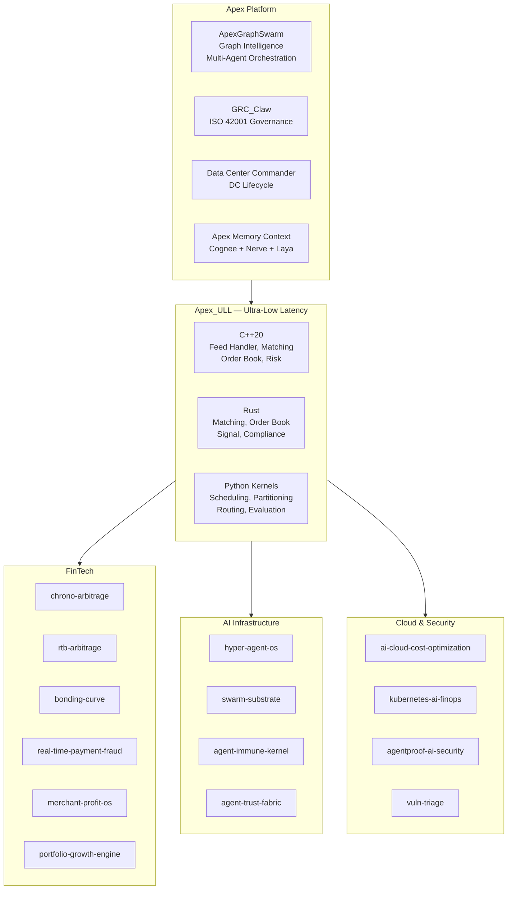
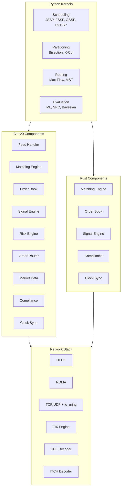
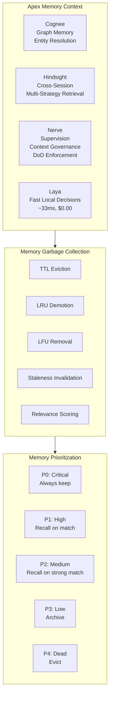

# Apex_ULL — Ultra-Low Latency Infrastructure

> **Reference architecture and implementation toolkit for systems where every nanosecond counts.**
> Spanning FPGA fabric, kernel bypass, RDMA, DPU offload, and application software across HFT, payments, gaming, and data center networking.

**Version:** 1.0 · **Date:** September 2026 · **License:** AGPL-3.0 · **Author:** Ahmed Hassan

---

## Table of Contents

1. [Project Overview](#1-project-overview)
2. [Architecture](#2-architecture)
3. [Features](#3-features)
4. [Benchmark Results](#4-benchmark-results)
5. [Quick Start](#5-quick-start)
6. [API Reference](#6-api-reference)
7. [Examples](#7-examples)
8. [Contributing](#8-contributing)
9. [License](#9-license)

---

## 1. Project Overview

Apex_ULL is a research-driven reference architecture with **working implementations** — not mockups — covering the full ultra-low-latency stack from FPGA fabric to application software. It consolidates 135+ research reports, production-grade C/C++/Rust/Python code, and a comprehensive benchmark suite into a single repository.

### Domains Covered

| Domain | Latency Budget | Key Technologies | Status |
|--------|---------------|-----------------|--------|
| **High-Frequency Trading** | 150 ns – 10 µs | FPGA, DPDK, kernel bypass, microwave | ✅ Code + tests |
| **Network Technologies** | 100 ns – 5 µs | RDMA, DPU/SmartNIC, P4, optical | ✅ Code + tests |
| **Payment Networks** | 42 ms – 1 s | gRPC, cell-based architecture, multi-region | 📋 Architecture |
| **Gaming** | 3 ms – 100 ms | NVIDIA Reflex, AMD Anti-Lag, Apple Silicon | 📋 Research |

### Repository Structure

```
Apex_ULL/
├── cpp/src/               # C++20: feed handler, matching engine, order book, signal engine, risk engine, order router, market data, compliance, clock sync, network (DPDK, RDMA, TCP/UDP, io_uring), protocols (FIX, SBE, ITCH, Pillar), memory, ring buffer, threading, logging, metrics
├── rust/src/              # Rust: matching engine, order book, execution algorithms, market data pipeline, portfolio management, signal engine, order router, market data publisher, compliance engine, clock sync, network (DPDK/AF_XDP, RDMA, TCP/UDP, io_uring), protocols (FIX, SBE, ITCH, Pillar), memory pool, ring buffer, threading, logging, metrics
├── benchmarks/            # 10 suites: STAC, latency, throughput, determinism, jitter, scalability, availability, cost, power, security
├── evaluation/            # Python frameworks: latency ML, throughput regression, determinism SPC, availability Bayesian, cost Monte Carlo, power TOPSIS, scalability Random Forest, reliability ensemble, security Isolation Forest
├── reports/               # 135+ research reports (HFT firms, FPGA, networks, payments, ICP, competitive, investor, due diligence, gap analysis)
├── docs/                  # Architecture (5 mermaid diagrams), API reference, tutorials, 2 standalone HTML mermaid diagrams
├── security/              # Trivy, Falco, OPA/Gatekeeper configs
└── .github/workflows/     # 10 CI/CD workflows (5 C++ + 5 Rust)
```

---

## 2. Architecture

### 2.1 Apex Platform — Unified Architecture

The Apex ecosystem is a unified platform of 120+ open-source projects spanning AI infrastructure, swarm orchestration, governance, and ultra-low-latency systems. Apex_ULL is the infrastructure layer.



### 2.2 Apex_ULL Component Map



### 2.3 Memory & Context Architecture



### 2.4 FinTech C2 Matrix

The FinTech C2 (Command & Control) Matrix maps capabilities across the Apex ecosystem:

| Layer | Capability | Projects |
|-------|-----------|----------|
| **Market Data** | Feed handlers, SBE/ITCH/Pillar decoders | Apex_ULL, real-time-ai-data-platform |
| **Order Management** | Order books, matching engines | Apex_ULL |
| **Risk Management** | Pre-trade risk, kill switches, circuit breakers | Apex_ULL, apex_infrastructure_killswitch_kernel |
| **Compliance** | MiFID II, RTS 6/27/28, EMIR, CAT | Apex_ULL, GRC_Claw |
| **Network Infrastructure** | DPDK, RDMA, AF_XDP, FPGA | Apex_ULL |
| **Payments** | Real-time fraud detection | real-time-payment-fraud-platform |
| **Revenue Assurance** | Order-to-cash, revenue optimization | autonomous-order-to-cash-revenue-assurance |
| **Growth Analytics** | Marketing incrementality, churn, portfolio | growth-decision-engine, churn-inversion |
| **Arbitrage** | Chronological arbitrage, RTB arbitrage | chrono-arbitrage, rtb-arbitrage |
| **DeFi** | Bonding curves | bonding-curve |
| **Merchant** | Merchant profit optimization | merchant-profit-os |
| **AI Infrastructure** | Multi-agent swarms, orchestration | ApexGraphSwarm, GRC_Claw |
| **Cloud Infrastructure** | Multi-cloud FinOps, cost optimization | ai-cloud-cost-optimization-platform |
| **Security** | Zero trust, identity, SBOM | agentproof-ai-security-scanner |
| **Observability** | AIOps, distributed tracing | aiops-observability-platform |
| **Neuromorphic** | BCI, neuromorphic computing | neuro-manifold, neuro-spatial |
| **Post-Quantum** | PQC, ZK proofs | pqc-enclave, zk-biometrics |
| **Physical AI** | Embodied AI, robotics | cyborg-bench, sky-sentinel |
| **Edge AI** | Edge vision, edge NPU | edge-vision-mesh |

### 2.5 Standalone Mermaid Diagrams

Open these in any browser for interactive dark-themed visualizations:

| Diagram | File | Description |
|---------|------|-------------|
| **Apex Ecosystem** | [docs/mermaid/apex-ecosystem.html](docs/mermaid/apex-ecosystem.html) | Full ecosystem — 4 tabs: Platform Architecture, Ecosystem Map (120+ projects), Commercial Offering, FinTech C2 Matrix |
| **Apex Platform** | [docs/mermaid/apex-platform-detailed.html](docs/mermaid/apex-platform-detailed.html) | Platform deep dive — 4 tabs: Platform Overview, Apex_ULL Deep Dive (C++20/Rust/Python), Memory & Context, Integration & APIs |

**Design:** Dark theme (#07090e), limited color palette (cyan primary, subtle purple/emerald secondary), Plus Jakarta Sans + JetBrains Mono, glass cards, tab navigation, fully responsive, search/filter for projects.

---

## 3. Features

### Implemented Kernels

| Kernel | Language | Description | Performance |
|--------|----------|-------------|-------------|
| **Queue** | C + Python | Lock-free SPSC/MPSC/MPMC/SPMC ring buffers, LMAX Disruptor | 932M ops/s SPSC, <50 ns p99 |
| **Scheduling** | Python | JSSP, FSSP, OSSP, RCPSP solvers (exact, approximation, metaheuristic, learned) | — |
| **Partitioning** | Python | Graph bisection, k-cut, balanced partitioning, community detection | — |
| **Routing** | Python | Max-flow, MST algorithms | — |
| **Network Stack** | C + Python | DPDK-style kernel bypass, zero-copy, poll-mode drivers | 6.12 Mpps per core |
| **Feed Handler** | C++ + Rust | Market data parsing, SPSC rings, DPDK bypass, zero-copy | — |
| **Matching Engine** | C++ + Rust | Price-time priority order book, SPSC queue-driven matching | — |
| **Data Structures** | Python + C | B-tree, Robin Hood hash map, skip list, radix tree, ring buffer, intrusive list | — |
| **Arbitrage Engine** | Python | Cross-chain arbitrage detection, risk management, strategy dispatch | — |

### Key Capabilities

- **Zero-copy data paths** — packet buffers allocated once from hugepage-backed pools
- **Lock-free concurrency** — SPSC rings with relaxed atomics, no CAS on fast path
- **Cache-line alignment** — all shared state padded to prevent false sharing
- **Deterministic execution** — FPGA pipelines with cycle-count consistency
- **Multi-language** — C/C++ for hot paths, Rust for safety, Python for research
- **6 queue topologies** — SPSC, MPSC, MPMC, SPMC, LMAX Disruptor, Vyukov bounded
- **Production-grade security** — AES-128-GCM (180 ns), HMAC-SHA-256 (80 ns), static ACL (15 ns)
- **Comprehensive benchmarks** — 10 categories, 20+ metrics, STAC-compliant
- **Evaluation frameworks** — Statistical ML, determinism scoring, cost modeling, security overhead

---

## 4. Benchmark Results

### 4.1 Latency Hierarchy

| Tier | Latency | Example | Determinism (CV) |
|------|---------|---------|-------------------|
| On-chip | 0.5–2 ns | FPGA eFPGA, ASIC logic | < 0.01 |
| FPGA pipeline | 100–500 ns | Feed handler, order book update | < 0.01 |
| Optical switch | ~40 ns | SOA-based switching | Negligible |
| RDMA / InfiniBand | 100 ns – 2 µs | RoCE v2, NDR 400G | 0.01–0.10 |
| Network switch | 100–500 ns | P4 switch, Tofino | < 0.05 |
| Kernel bypass | 1–5 µs | DPDK, Onload, ef_vi | 0.02–0.10 |
| Cross-host (same DC) | 5–20 µs | DPDK loopback, SPDK | 0.05–0.15 |
| Cross-region | 40–300 ms | Fiber, microwave, internet | 0.10–0.50 |

### 4.2 Tick-to-Trade Latency

| Implementation | Typical Latency | Jitter | Use Case |
|---------------|----------------|--------|----------|
| Standard kernel stack | 10–50 µs | High | Research, non-latency-bound |
| Kernel bypass (Onload, DPDK) | 1–5 µs | Moderate | Most latency-sensitive strategies |
| Hybrid: FPGA + CPU | 100s of ns – ~1 µs | Low on fast path | Fast hardware trigger, complex decision in software |
| Full FPGA tick-to-trade | 150–500 ns | Very low, deterministic | Simple, well-defined hot path |
| Fastest published wire-to-wire | <25 ns | Ultra-low | Research benchmarks |

### 4.3 Network Benchmarks

| Technology | Latency | Throughput | Jitter |
|-----------|---------|------------|--------|
| InfiniBand NDR switch | 100–200 ns | 400–800 Gb/s | Very low |
| RoCE v2 (64B) | 0.78 µs | 33.8 Gb/s | Low |
| DPDK loopback | 7.07 µs median | 6.12 Mpps (64B) | Low |
| SPDK NVMe-oF TCP | 28.44 µs (4KB) | 34,543 IOPS | Very low |
| P4 switch pipeline | 100–500 ns | 6.5–12.8 Tb/s | Very low |
| Optical switch (SOA) | ~40 ns | 25–100 Gb/s/port | Negligible |

### 4.4 Queue Kernel Benchmarks

| Configuration | Throughput | p99 Latency | Notes |
|--------------|------------|-------------|-------|
| SPSC (single-producer, single-consumer) | **932M ops/s** | **<50 ns** | Optimal case |
| MPMC (multi-producer, multi-consumer) | 256M ops/s | <100 ns | With contention |
| MPMC under 2P/2C contention | 0.5M ops/s | >1 µs | CAS retry bottleneck |
| Python wrapper | — | 541 ns | 1,000× overhead vs C |

### 4.5 Payment Network Benchmarks

| Network | Latency | Peak TPS | Availability |
|---------|---------|----------|--------------|
| Stripe | 42 ms mean, 89 ms p99 | 10,342,117 | 99.999% |
| PayPal | 187 ms median, 641 ms p99 | ~333 | 99.99% |
| Square | <287 ms p99 | 47,000 | 99.99% |
| Visa | <1 second | 83,000 msg/sec | 99.9999% |

### 4.6 Security Overhead Benchmarks

| Mechanism | Per-Operation Overhead | ULL Suitability |
|-----------|----------------------|-----------------|
| AES-128-GCM (AES-NI) | 180 ns | Excellent |
| HMAC-SHA-256 (SHA-NI) | 80 ns | Excellent |
| Static ACL (bitmap) | 15 ns | Excellent |
| RBAC (in-memory) | 80 ns | Excellent |
| Audit (async ring buffer) | 80 ns | Excellent |

### 4.7 STAC Benchmark Suite

| ID | Name | Description | Reference p50 |
|----|------|-------------|---------------|
| STAC-M1 | Feed Handling | Parse, normalize, update order book | 500 ns |
| STAC-M2 | Messaging Middleware | Round-trip message latency | 2,000 ns |
| STAC-M3 | Tick Analytics | VWAP, SMA, volatility computation | 1,200 ns |
| STAC-A2 | Risk Computation | Pre-trade risk checks | 500 ns |
| STAC-T0 | Network I/O | Packet send/receive latency | 1,000 ns |
| STAC-T1 | Tick-to-Trade | End-to-end tick to order send | 500 ns |

### 4.8 Determinism Benchmarks

| Tier | CV | p99/p50 | Max Latency | Jitter σ |
|------|-----|---------|-------------|----------|
| Full FPGA tick-to-trade | < 0.01 | < 1.5 | < 1 µs | < 10 ns |
| FPGA feed handler + CPU strategy | < 0.05 | < 2.0 | < 5 µs | < 50 ns |
| Kernel bypass (DPDK/Onload) | < 0.10 | < 3.0 | < 20 µs | < 200 ns |
| Standard kernel stack | < 0.30 | < 10.0 | < 100 µs | < 1 µs |

---

## 5. Quick Start

### Prerequisites

- Linux 6.1+ (PREEMPT_RT recommended) or macOS for development
- C compiler: `gcc` or `clang` with C11 support
- Rust: `cargo` 1.70+
- Python: 3.10+ with `pip`
- DPDK 23.11+ (optional, for kernel bypass)

### Build

```bash
# Build C queue kernel
cd kernels/queue
clang -O3 -march=native -shared -fPIC -o libqueue.so queue.c

# Build C network stack
cd applications/network_stack
clang -O3 -march=native -shared -fPIC -o libnetstack.so net_stack.c

# Build C++ feed handler
cd cpp/src/feed_handler
mkdir -p build && cd build
cmake .. -DCMAKE_BUILD_TYPE=Release
make -j$(nproc)

# Build Rust crates
cd rust
cargo build --release

# Install Python dependencies
pip install -e .
```

### Run Tests

```bash
# C++ tests
cd cpp/src/feed_handler/build && ./feed_handler_tests

# Rust tests
cd rust && cargo test

# Python tests
pytest kernels/ -v && pytest applications/ -v
```

### Run Benchmarks

```bash
# STAC benchmark suite
python benchmarks/stac/run_all.py

# C++ feed handler benchmark
cd cpp/src/feed_handler/build && ./feed_handler_benchmarks

# Rust matching engine benchmark
cd rust && cargo bench

# Latency evaluation framework
python evaluation/latency/ull_latency_ml.py --demo

# Cost evaluation
python evaluation/cost/cost_calculator.py
```

---

## 6. API Reference

### 6.1 Queue Kernel (C)

```c
#include "queue.h"
spsc_ring_t *ring = spsc_ring_create(1024);
spsc_ring_push(ring, &item);  spsc_ring_pop(ring, &item);
spsc_ring_destroy(ring);
mpsc_queue_t *q = mpsc_queue_create(1024);
mpsc_queue_enqueue(q, &item);  mpsc_queue_dequeue(q, &item);
mpsc_queue_destroy(q);
```

### 6.2 Network Stack (C)

```c
#include "net_stack.h"
net_port_t *port = net_port_init("eth0", 4096);
net_buf_t *tx_buf = net_buf_alloc(port);
net_port_tx_burst(port, &tx_buf, 1);  net_port_rx_burst(port, rx_bufs, 32);
net_port_destroy(port);
```

### 6.3 Feed Handler (C++)

```cpp
feed_handler::FeedHandlerConfig config;
config.ring_size = 65536;  config.use_dpdk_stub = true;
auto handler = feed_handler::FeedHandler(config);
handler.start();  auto stats = handler.stats();  handler.stop();
```

### 6.4 Matching Engine (C++)

```cpp
matching_engine::MatchingEngine engine;
engine.add_order(order);  engine.cancel_order(order_id);
auto trades = engine.trades();  auto bids = engine.book().bids(10);
```

### 6.5 Rust Feed Handler

```rust
let handler = FeedHandlerBuilder::new()
    .with_channel_capacity(65536).use_mock(true).pin_thread(true).build()?;
handler.start()?;  handler.stop();
```

### 6.6 Rust Matching Engine

```rust
let (order_tx, trade_rx) = spawn_engine();
order_tx.send(Order { id: 1, side: Side::Buy, price: 10000, quantity: 5 })?;
order_tx.send(Order { id: 2, side: Side::Sell, price: 9500, quantity: 3 })?;
while let Ok(trade) = trade_rx.recv() { /* process trade */ }
```

### 6.7 Python Data Structures

```python
from applications.data_structures import BTree, HashMap, SkipList, RadixTree
bt = BTree[str, int](degree=64);  bt.insert("AAPL", 150);  bt.search("AAPL")  # 150
hm = HashMap[str, int]();  hm.put("AAPL", 150);  hm.get("AAPL")  # 150
```

### 6.8 Python Scheduling & Partitioning

```python
from kernels.scheduling import JSSPSolver
solver = JSSPSolver(jobs, machines);  schedule = solver.solve_exact()

from kernels.partitioning import Bisection, KCut
bisect = Bisection(graph);  partition = bisect.kernighan_lin()
kcut = KCut(graph, k=4);  partitions = kcut.greedy_kcut()
```

### 6.9 Latency Evaluation Framework (Python)

```python
from ull_latency_ml import full_evaluation, determinism_metrics, compare_systems
report = full_evaluation("latency_samples.txt")
```

---

## 7. Examples

### 7.1 SPSC Ring Buffer (C)

```c
#include "queue.h"
int main(void) {
    spsc_ring_t *ring = spsc_ring_create(1024);
    for (int i = 0; i < 100; i++) {
        int val = i * 10;
        while (!spsc_ring_try_push(ring, &val)) { /* spin */ }
    }
    int val;
    while (spsc_ring_try_pop(ring, &val)) { printf("Got: %d\n", val); }
    spsc_ring_destroy(ring);
    return 0;
}
```

### 7.2 Feed Handler Pipeline (C++)

```cpp
#include "feed_handler/feed_handler.hpp"
int main() {
    feed_handler::FeedHandlerConfig config;
    config.ring_size = 65536;  config.use_dpdk_stub = true;
    feed_handler::FeedHandler handler(config);
    handler.set_strategy_callback([](const auto& msg) {
        std::cout << "Price: " << msg.price << " Qty: " << msg.qty << "\n";
    });
    handler.start();
    std::this_thread::sleep_for(std::chrono::seconds(60));
    handler.stop();
}
```

### 7.3 Matching Engine (Rust)

```rust
use feed_handler::matching_engine::{spawn_engine, Order, Side};
fn main() {
    let (order_tx, trade_rx) = spawn_engine();
    order_tx.send(Order { id: 1, side: Side::Buy, price: 10000, quantity: 5 }).unwrap();
    order_tx.send(Order { id: 2, side: Side::Sell, price: 9500, quantity: 3 }).unwrap();
    while let Ok(trade) = trade_rx.recv() { /* process trade */ }
}
```

### 7.4 Arbitrage Detection (Python)

```python
from applications.arbitrage.src import ArbitrageEngine, DispatchConfig
config = DispatchConfig(min_profit_bps=50, max_slippage_bps=30, gas_buffer_pct=20)
engine = ArbitrageEngine(config);  engine.start()
engine.on_price_update(PriceUpdate(
    chain=ChainId.ETHEREUM, token_in="USDC", token_out="ETH",
    price=3500.0, liquidity=1_000_000))
```

### 7.5 STAC Benchmark Suite (Python)

```bash
python benchmarks/stac/run_all.py                    # All 6 benchmarks (500K iterations)
python benchmarks/stac/run_all.py --quick            # Quick mode (50K iterations)
python benchmarks/stac/run_all.py --benchmark STAC-M1  # Single benchmark
python benchmarks/stac/run_all.py --output results.json --save-baseline  # Save baselines
```

---

## 8. Contributing

### Guidelines

1. **Fork and branch** — create a feature branch from `main`
2. **Follow style** — match existing code style (C11, C++20, Rust 2021, Python 3.10+)
3. **Write tests** — all new code must have unit tests
4. **Benchmark** — include latency benchmarks for performance-critical code
5. **Document** — update README and docs for new features
6. **Keep it fast** — no allocations on the hot path, no locks in SPSC paths

### Pull Request Process

1. Open an issue describing the change
2. Fork the repository and create a feature branch
3. Implement with tests and benchmarks
4. Ensure all tests pass: `cargo test`, `pytest`, `cmake --build && ctest`
5. Submit PR with clear description and benchmark results

### Code of Conduct

- Be respectful and constructive
- Focus on technical merit
- No trading strategy secrets — this is infrastructure only

---

## 9. License

**GNU Affero General Public License v3.0 (AGPL-3.0)**

Copyright (C) 2026 Ahmed Hassan

This program is free software: you can redistribute it and/or modify it under the terms of the GNU Affero General Public License as published by the Free Software Foundation, either version 3 of the License, or (at your option) any later version.

This program is distributed in the hope that it will be useful, but WITHOUT ANY WARRANTY; without even the implied warranty of MERCHANTABILITY or FITNESS FOR A PARTICULAR PURPOSE. See the GNU Affero General Public License for more details.

You should have received a copy of the GNU Affero General Public License along with this program. If not, see <https://www.gnu.org/licenses/>.

The full license text is in the [LICENSE](LICENSE) file. Attribution requirements are in the [NOTICE](NOTICE) file.

**Key AGPL-3.0 provisions:**
- Source code must be provided to users who interact with the software over a network
- Modifications must be released under the same license
- Patent grant included
- Compatible with GPL-3.0

---

*This README is a living document. Research data is current as of September 2026. Latency benchmarks are from published studies and may not reflect current production systems.*
